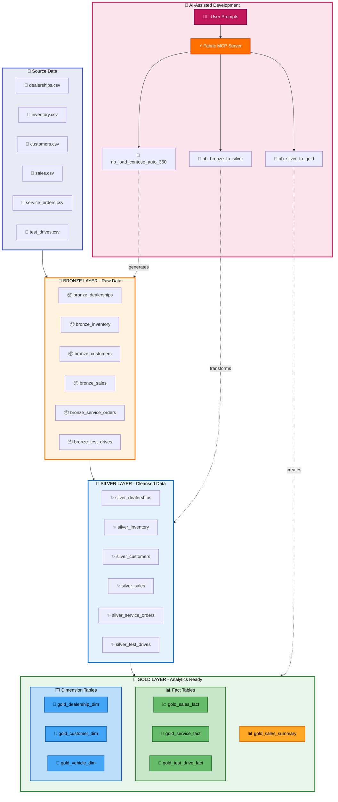
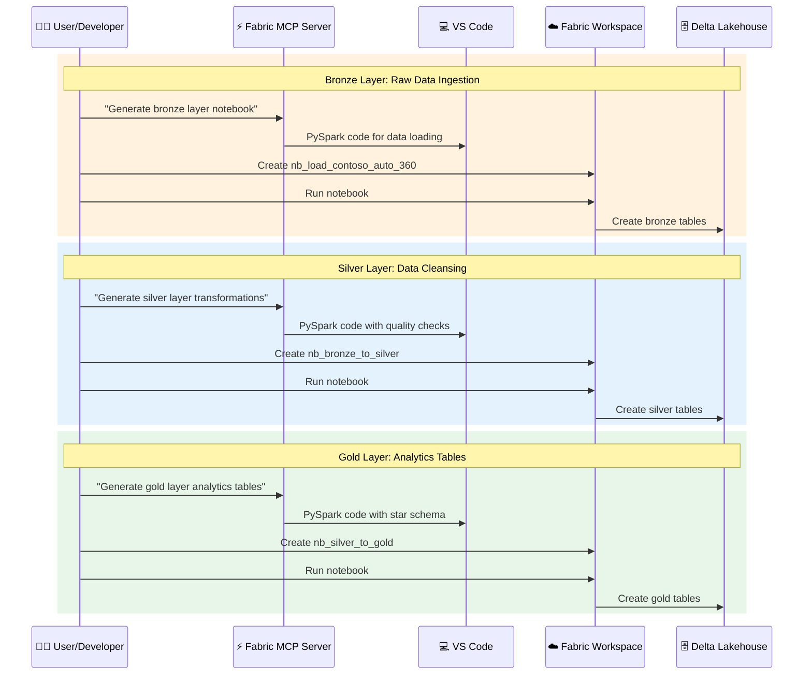

# Lab 1 Architecture — Medallion Architecture with Fabric MCP

## Overview

Lab 1 implements a complete medallion architecture (bronze, silver, gold) in Microsoft Fabric Lakehouse using AI-assisted development with Fabric MCP Server.

## 📊 Architecture Diagram



## Data Flow Details

### Bronze Layer (Raw Ingestion)

- **Purpose:** Capture raw data exactly as received
- **Process:** Load CSV files from Files/raw into Delta tables
- **Notebook:** `nb_load_contoso_auto_360`
- **Generated by:** Fabric MCP Server using prompt: "Generate PySpark code to load CSV files from Files/raw into delta tables"

### Silver Layer (Cleansing & Standardization)

- **Purpose:** Create clean, validated, business-ready data
- **Transformations:**
  - Remove duplicate records
  - Handle null values
  - Standardize data types and formats
  - Add audit columns (load_timestamp, source_system)
  - Apply data quality validations
- **Notebook:** `nb_bronze_to_silver`
- **Generated by:** Fabric MCP Server using prompt: "Create silver layer transformations with deduplication, null handling, standardization..."

### Gold Layer (Analytics-Optimized)

- **Purpose:** Build dimension and fact tables optimized for analytics
- **Tables:**
  - **Fact Tables:** Enriched with all necessary dimensions
    - gold_sales_fact
    - gold_service_fact
    - gold_test_drive_fact
  - **Dimension Tables:** Clean reference data
    - gold_dealership_dim
    - gold_customer_dim
    - gold_vehicle_dim
  - **Aggregate Tables:** Pre-calculated metrics
    - gold_sales_summary
- **Notebook:** `nb_silver_to_gold`
- **Generated by:** Fabric MCP Server using prompt: "Create gold layer fact and dimension tables optimized for Power BI analytics..."

## Key Components

| Component | Technology | Purpose |
|-----------|-----------|---------|
| **Fabric Lakehouse** | Delta Lake | Unified storage for all layers |
| **Bronze Tables** | Delta Tables | Raw data persistence |
| **Silver Tables** | Delta Tables | Cleansed, validated data |
| **Gold Tables** | Delta Tables | Analytics-ready star schema |
| **Notebooks** | PySpark | Data transformation logic |
| **Fabric MCP Server** | AI Assistant | Generate notebook code from prompts |
| **VS Code** | IDE | Development environment |

## 🔄 AI-Assisted Development Workflow



## Sample Prompts Used

### Bronze Layer
```text
Generate PySpark code to load CSV files from Files/raw into delta tables
```

### Silver Layer
```text
I have bronze tables in my Fabric Lakehouse: dealerships, inventory, customers, sales, service_orders, and test_drives.
Create a notebook that transforms these into silver layer tables with the following:
- Remove duplicate records
- Handle null values appropriately
- Standardize data types and formats
- Add audit columns (load_timestamp, source_system)
- Apply data quality validations
```

### Gold Layer
```text
Based on my silver layer tables, create a notebook that builds gold layer tables optimized for Power BI analytics:
- gold_sales_fact: Enriched sales data joined with dimensions
- gold_service_fact: Enriched service order data
- gold_test_drive_fact: Test drive analysis with conversion metrics
- Dimension tables: dealership, customer, vehicle
- gold_sales_summary: Daily aggregated sales metrics
```

## Benefits of This Architecture

- ✅ **Separation of Concerns:** Each layer has a specific purpose
- ✅ **Data Quality:** Progressive refinement from bronze to gold
- ✅ **Reusability:** Silver layer can support multiple gold layer use cases
- ✅ **Performance:** Gold layer optimized for query performance
- ✅ **Auditability:** Full lineage from raw to analytics-ready
- ✅ **AI-Assisted:** Rapid development using natural language prompts

## Technical Specifications

- **Workspace:** ContosoAuto360-MCP-Workshop
- **Lakehouse:** lh_contoso_auto_360
- **Storage Format:** Delta Lake
- **Compute:** Fabric Spark
- **Development:** PySpark in Fabric Notebooks
- **AI Tool:** Fabric MCP Server in VS Code

---

**Next Step:** Use gold layer tables in Lab 3 for semantic model development
