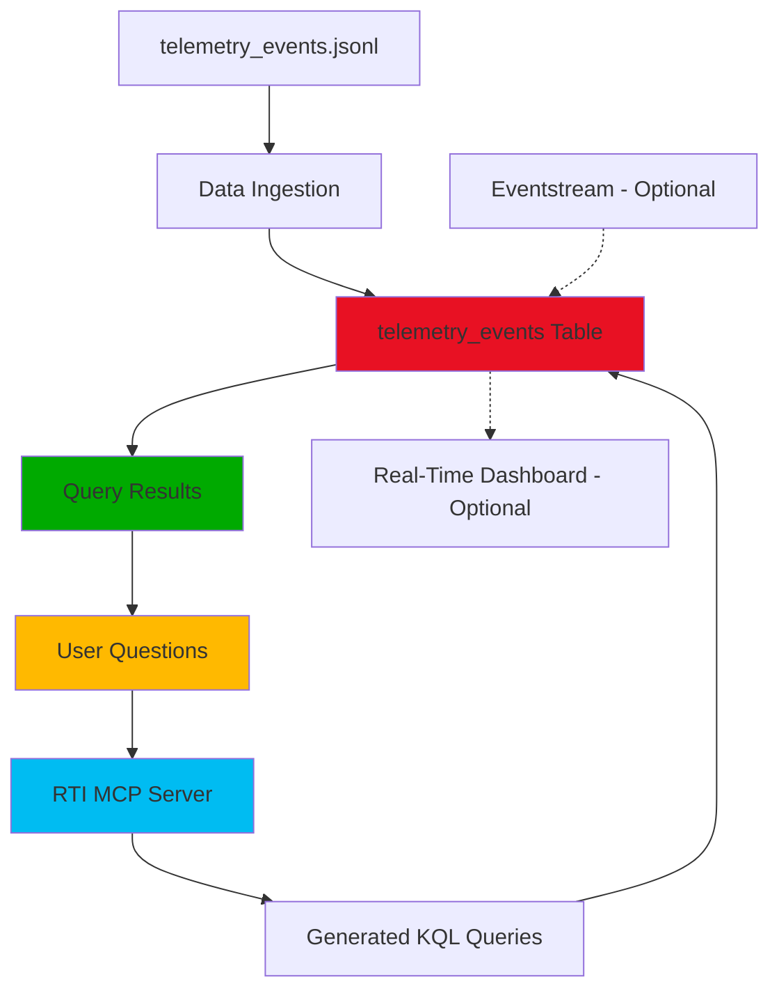
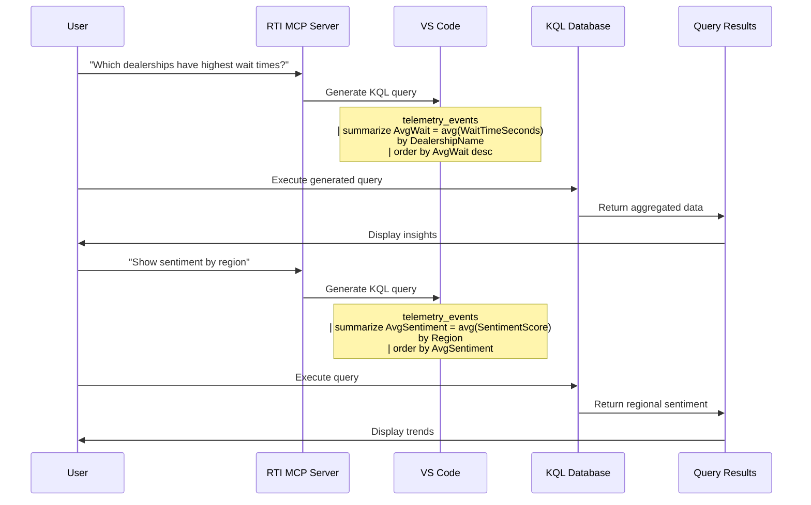
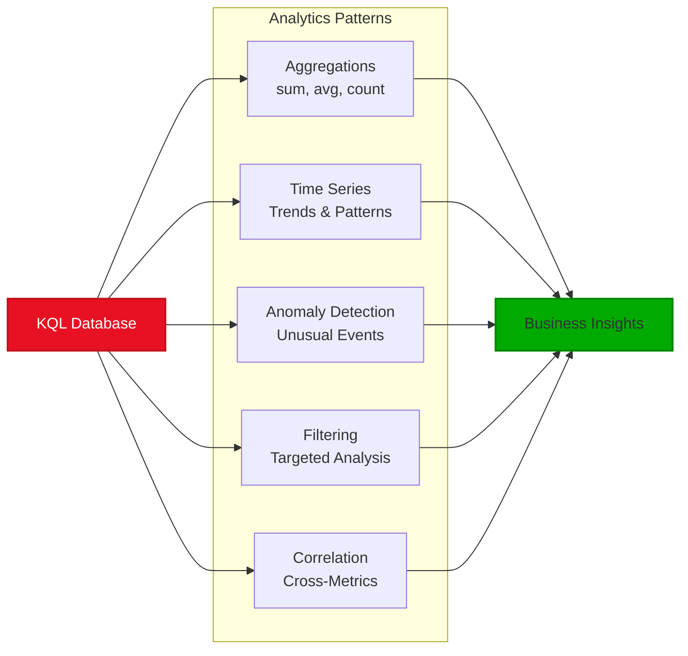
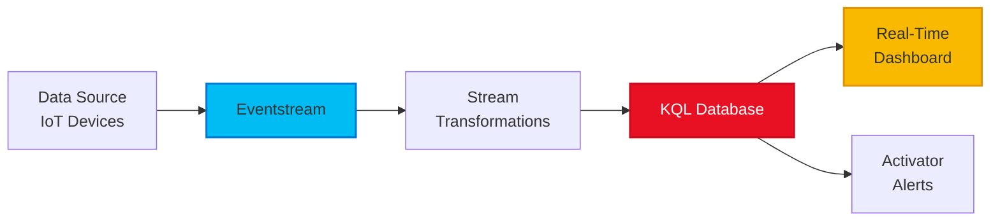

# Lab 2 Architecture — Real-Time Intelligence with RTI MCP

## Overview

Lab 2 implements real-time telemetry analytics using Microsoft Fabric's Real-Time Intelligence (Eventhouse + KQL) with AI-assisted query generation via RTI MCP Server.

## Architecture Diagram



## Data Flow Details

### 1. Data Ingestion
- **Source:** telemetry_events.jsonl file with real-time dealership operational data
- **Method:** Direct upload to KQL database or streaming via Eventstream
- **Target:** telemetry_events table in KQL database

### 2. KQL Table Schema

```kusto
.create table telemetry_events (
    EventID: long,
    EventTime: datetime,
    DealershipID: long,
    DealershipName: string,
    City: string,
    Region: string,
    Country: string,
    DeviceType: string,
    Zone: string,
    EventType: string,
    CustomerCount: long,
    WaitTimeSeconds: long,
    SentimentScore: real,
    QueueLength: long,
    AlertFlag: bool
)
```

### 3. AI-Assisted Query Generation
- **Tool:** RTI MCP Server in VS Code
- **Process:** Convert natural language questions to KQL queries
- **Benefit:** No need to know KQL syntax

## AI-Assisted Analytics Workflow



## Sample Business Questions & Generated Queries

### Average Wait Time by Dealership
**Question:**
```text
Which dealerships have the highest average wait time?
```

**Generated KQL:**
```kusto
telemetry_events
| summarize AvgWaitTimeSec = avg(WaitTimeSeconds) by DealershipName, City, Region
| order by AvgWaitTimeSec desc
| take 10
```

### Sentiment Analysis by Region
**Question:**
```text
What is the average sentiment score by region?
```

**Generated KQL:**
```kusto
telemetry_events
| summarize AvgSentiment = avg(SentimentScore) by Region
| order by AvgSentiment asc
```

### Queue Spike Detection
**Question:**
```text
Which dealerships experience the most queue spikes?
```

**Generated KQL:**
```kusto
telemetry_events
| where QueueLength >= 10
| summarize SpikeEvents = count() by DealershipName, City
| order by SpikeEvents desc
```

### Alert Analysis
**Question:**
```text
Which events trigger alerts most frequently?
```

**Generated KQL:**
```kusto
telemetry_events
| where AlertFlag == true
| summarize AlertCount = count() by EventType, Zone
| order by AlertCount desc
```

## Architecture Components

| Component | Technology | Purpose |
|-----------|-----------|---------|
| **Eventhouse** | Fabric RTI | Container for real-time data |
| **KQL Database** | Azure Data Explorer | High-performance analytics engine |
| **telemetry_events** | KQL Table | Stores operational telemetry |
| **RTI MCP Server** | AI Assistant | Generates KQL from natural language |
| **VS Code** | IDE | Development environment |
| **Eventstream** (Optional) | Fabric Streaming | Real-time data ingestion |

## Real-Time Analytics Capabilities



## Sample Use Cases

### Operational Monitoring
- Monitor wait times across dealerships in real-time
- Identify locations needing immediate attention
- Track customer satisfaction trends

### Performance Analysis
- Compare dealership operational efficiency
- Identify peak traffic times and patterns
- Analyze queue management effectiveness

### Alert Management
- Detect and respond to operational issues
- Track alert patterns by zone and device type
- Establish baseline for normal operations

### Regional Insights
- Compare performance across geographic regions
- Identify regional operational best practices
- Allocate resources based on regional demand

## Optional: Real-Time Streaming Architecture



## Key Benefits

✅ **Real-Time Analytics:** Query streaming data instantly
✅ **High Performance:** KQL optimized for time-series data
✅ **Natural Language:** Use business questions, not query syntax
✅ **Scalability:** Handle millions of events per second
✅ **Integration:** Connect to Power BI, Azure, and Fabric services
✅ **AI-Assisted:** RTI MCP generates complex queries from simple prompts

## Technical Specifications

- **Workspace:** ContosoAuto360-MCP-Workshop
- **Eventhouse:** eh_contoso_auto_360
- **KQL Database:** kql_contoso_auto_360
- **Query Language:** Kusto Query Language (KQL)
- **AI Tool:** RTI MCP Server in VS Code
- **Data Format:** JSONL (JSON Lines)

## Integration with Other Labs

- **From Lab 1:** Can join KQL data with Lakehouse gold tables for combined analysis
- **To Lab 3:** Real-time data can supplement historical semantic model queries

---

**Key Skill:** Using natural language to generate KQL queries without knowing query syntax
