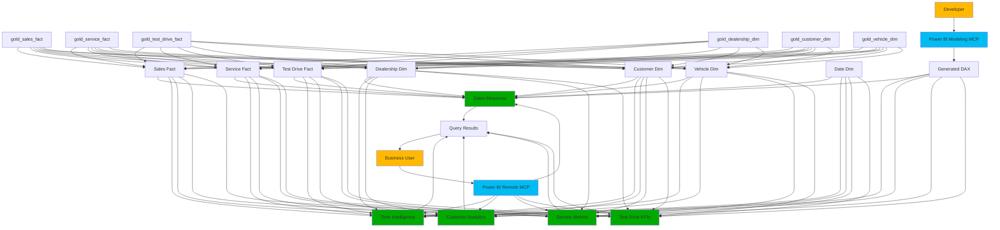
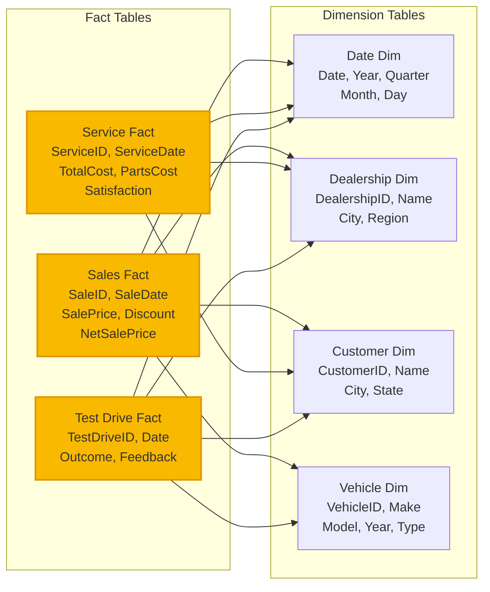
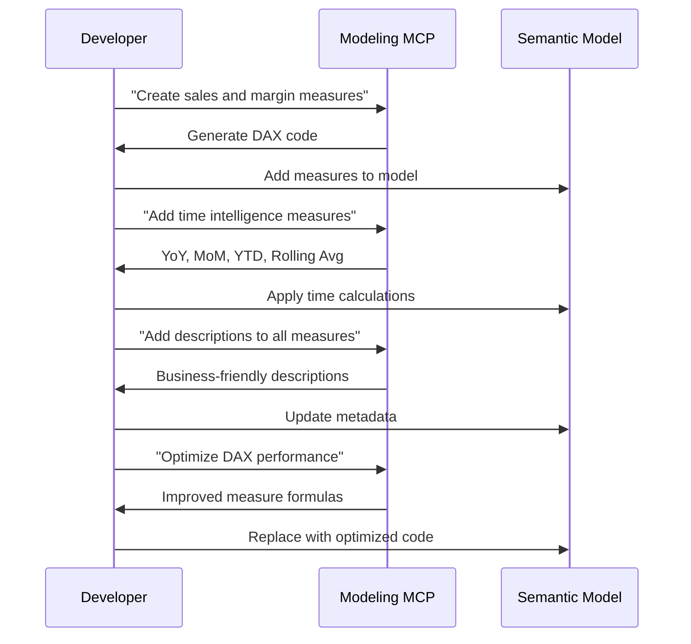
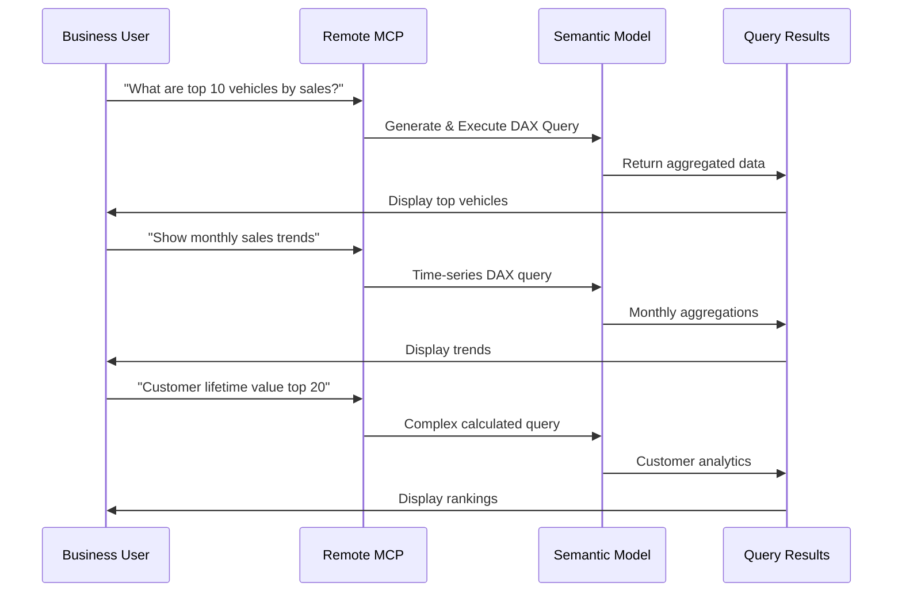
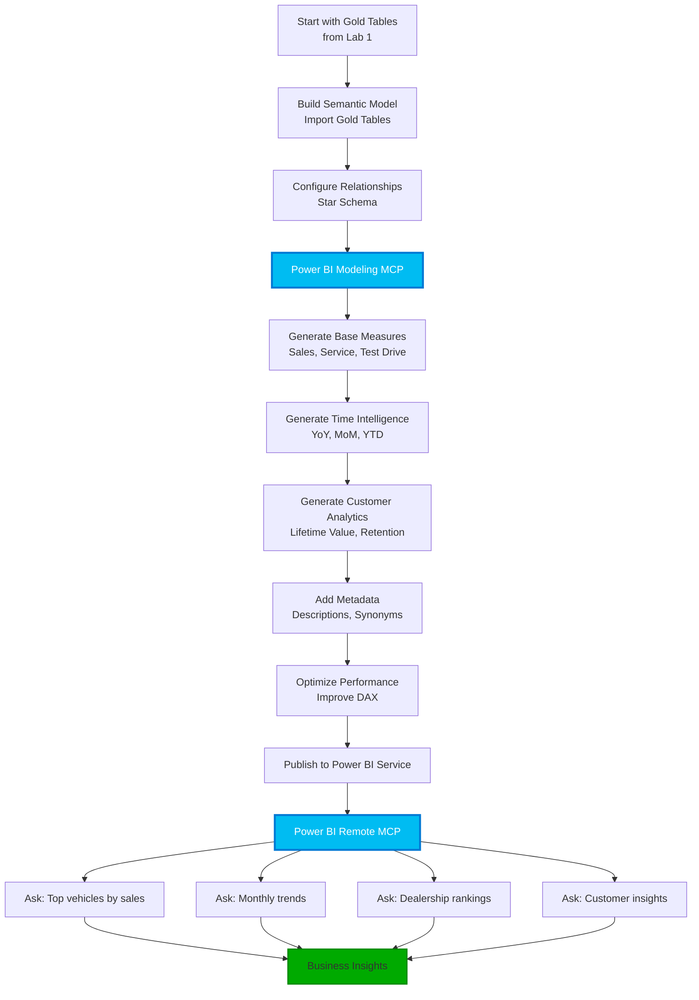
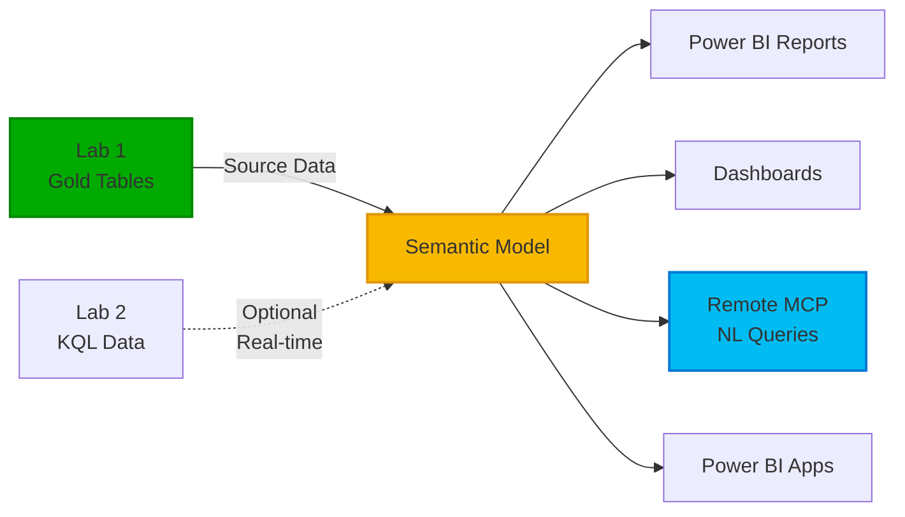

# Lab 3 Architecture — Power BI Semantic Model with MCP Servers

## Overview

Lab 3 builds a production-ready Power BI semantic model on top of Lab 1's gold layer tables, using both Power BI MCP Servers for AI-assisted development and natural language querying.

## Architecture Diagram



## Semantic Model Structure

### Star Schema Design



## Two MCP Servers in Action

### 1. Power BI Modeling MCP Server
**Purpose:** Generate DAX measures and enhance model metadata



### 2. Power BI Remote MCP Server
**Purpose:** Query semantic model using natural language



## Measure Categories Created

### 1. Sales Metrics
```dax
Total Sales = SUM(gold_sales_fact[NetSalePrice])
Total Discount = SUM(gold_sales_fact[Discount])
Gross Margin = SUM(gold_sales_fact[NetSalePrice]) - SUM(gold_sales_fact[Cost])
Vehicle Units Sold = COUNTROWS(gold_sales_fact)
Average Sale Price = AVERAGE(gold_sales_fact[NetSalePrice])
```

### 2. Time Intelligence
```dax
Sales YoY = [Total Sales] - CALCULATE([Total Sales], SAMEPERIODLASTYEAR('Date'[Date]))
Sales YoY % = DIVIDE([Sales YoY], CALCULATE([Total Sales], SAMEPERIODLASTYEAR('Date'[Date])))
Sales YTD = TOTALYTD([Total Sales], 'Date'[Date])
Sales Rolling 3M = CALCULATE([Total Sales], DATESINPERIOD('Date'[Date], LASTDATE('Date'[Date]), -3, MONTH))
```

### 3. Customer Analytics
```dax
Customer Lifetime Value = 
    SUMX(
        VALUES(gold_customer_dim[CustomerID]),
        CALCULATE([Total Sales]) + CALCULATE([Service Revenue])
    )

New Customers = CALCULATE(DISTINCTCOUNT(gold_sales_fact[CustomerID]), ...)
Customer Retention Rate = DIVIDE([Returning Customers], [Total Customers])
```

### 4. Service Metrics
```dax
Service Revenue = SUM(gold_service_fact[TotalCost])
Service Margin = [Service Revenue] - SUM(gold_service_fact[PartsCost]) - SUM(gold_service_fact[LaborCost])
Avg Customer Satisfaction = AVERAGE(gold_service_fact[SatisfactionScore])
```

### 5. Test Drive KPIs
```dax
Test Drive Count = COUNTROWS(gold_test_drive_fact)
Converted Test Drives = CALCULATE(COUNTROWS(gold_test_drive_fact), gold_test_drive_fact[Outcome] = "Converted")
Test Drive Conversion Rate = DIVIDE([Converted Test Drives], [Test Drive Count])
```

## AI-Assisted Development Workflow



## Sample Prompts Used

### Modeling MCP - Create Measures
**Prompt:**
```text
I have a Power BI semantic model with these tables:
- gold_sales_fact (SalePrice, Discount, NetSalePrice, SaleDate, DealershipID, CustomerID, VehicleID)
- gold_service_fact (TotalCost, PartsCost, LaborCost, SatisfactionScore, ServiceDate)
- gold_test_drive_fact (TestDriveDate, Outcome, DealershipID)

Create essential business measures for:
- Total sales revenue and discounts
- Gross margin calculations
- Service revenue and margins
- Test drive conversion tracking
```

### Modeling MCP - Time Intelligence
**Prompt:**
```text
Add time intelligence measures for my sales and service facts:
- Year-over-year growth
- Month-over-month comparison
- Year-to-date totals
- Rolling 3-month and 12-month averages
```

### Modeling MCP - Metadata
**Prompt:**
```text
Add business-friendly descriptions to all tables, columns, and measures for non-technical users
```

### Remote MCP - Sales Analysis
**Prompt:**
```text
What are the top 10 vehicle makes by total sales revenue?
```

### Remote MCP - Performance Comparison
**Prompt:**
```text
Which dealerships have the highest gross margin percentage?
```

### Remote MCP - Customer Insights
**Prompt:**
```text
What is the customer lifetime value for the top 20 customers?
```

## Key Components

| Component | Technology | Purpose |
|-----------|-----------|---------|
| **Semantic Model** | Power BI Dataset | Unified business logic layer |
| **Gold Tables** | Delta Lake | Source data from Lab 1 |
| **Star Schema** | Dimensional Model | Optimized for analytics |
| **DAX Measures** | Data Analysis Expressions | Business calculations |
| **Modeling MCP** | AI Assistant | Generate measures & metadata |
| **Remote MCP** | AI Assistant | Query model with natural language |
| **VS Code** | IDE | Development environment |
| **Power BI Service** | Cloud Platform | Host and share semantic model |

## Architecture Benefits

✅ **Built on Gold Layer:** Clean, analytics-ready data from Lab 1
✅ **Star Schema:** Optimized query performance
✅ **Reusable Measures:** Consistent calculations across all reports
✅ **AI-Generated DAX:** Rapid measure development
✅ **Natural Language Queries:** Business users query without DAX knowledge
✅ **Rich Metadata:** Descriptions improve AI query generation
✅ **Time Intelligence:** Sophisticated date calculations built-in
✅ **Customer Analytics:** Deep insights into customer behavior

## Integration Points



## Technical Specifications

- **Workspace:** ContosoAuto360-MCP-Workshop
- **Semantic Model:** sm_contoso_auto_360
- **Storage Mode:** Import (from gold tables)
- **Measure Count:** 30+ measures
- **Relationships:** Star schema with proper cardinality
- **AI Tools:** 
  - Power BI Modeling MCP Server (measure generation)
  - Power BI Remote MCP Server (natural language queries)
- **Development:** VS Code + Power BI Desktop
- **Deployment:** Power BI Service

---

**Key Innovation:** Using two specialized MCP servers for both development (Modeling) and consumption (Remote querying)
